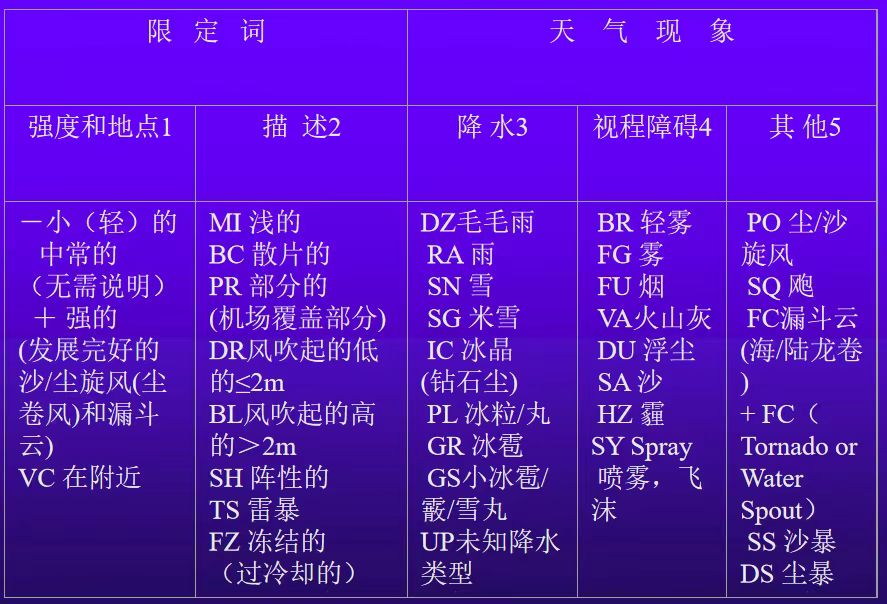

# 国外不规则报文识别
来源：四川航空国外不规则报文PPT

目前，国际航空气象电码（TAF和METAR）是世界航空气象界最通用的电码，但一些国家如俄罗斯、独联体、美国、加拿大等国家所采用的单位和编发规则与ICAO推荐的不甚一致（根据地区和国家电码措施，一些成员使用法定英里，其小部分根据国家规定编码）。另外各国是根据本国的实际情况编发RMK（附注）组的一些内容，因此，有必要了解这些国家发布的航空气象电码与我国的不同之处，更好地使用这些资料 。

##  一、俄罗斯、独联体的报文
### 1. RMK组内容

> 例：UNNT 10Jun02 09:00Z的实况
> UNNT 100900Z 23005G08MPS 9999 FEW050CB OVC200 26/13 Q0999 NOSIG RMK QFE740 0986 ***25090070***=

解释：新近执行的METAR报文WS ALL RWY的后面增加R~R~R~R~E~R~C~R~e~R~e~R~B~R~B~R~表示跑道状况，我国暂不执行。在得到机场管理部门的信息后，在METAR中应报告该项。
RRRR代表跑道编号、E~R~表示跑道堆积物（deposit）（见0919电码）、C~R~表示跑道被污染的范围（如被雪覆盖的范围见0519电码）。e~R~e~R~表示跑道堆积物的深度（见1079电码）B~R~B~R~ 表示摩擦系数/刹车（见电码0366）。
当机场因严重积雪关闭时，用缩写“SNOCLO”取代跑道状况组;如果污染情况在机场的唯一跑道或全部跑道不再存在，本组报告最后六位数用“CLRD//”取代。

**0919 E~R~ code figure**
|代码|含义|
|--|--|
|0| Clear and dry |
|1| Damp(潮湿的) |
|2| Wet and water patches(班、块) |
|3| Rime（白霜）and frost coverd （深度小于1mm） |
|4| Dry snow |
|5| Wet snow |
|6| Slush |
|7| Ice |
|8| Compacted（压紧） or rolled （碾平） snow |
|9| Frozen ruts （辙）or ridges（脊） |
|/| Type of deposit not reported (due to runway clearance in progress) |

**0519 C~R~ Extent of runway contaminationcode figure**
|代码| 含义 |
|--|--|
| 1 | Less than 10 percent of runway contaminated （污染或covered） |
|2| 11 percent to 25 percent of runway contaminated (covered)|
|3|Reserved（维持）|
|4|Reserved（维持）|
|5|26 percent to 50 percent of runway contaminated（污染或covered）|
|6|Reserved（维持）
|7|Reserved|
|8|Reserved|
|9|51 percent to 100 percent of runway contaminated(covered)|
|/|Not reported (due to runway clearance in progress)|

**1079 e~R~e~R~ Depth of deposit code figure**
|代码| 含义|
|--  |--|
|00 | Less than 1 mm|
|01|1mm|
|02|2mm|
|...|...|
|90|90mm|
|91|Reserved|
|92|10cm|
|93|15cm|
|94|20cm|
|95|25cm|
|96|30cm|
|97|35cm|
|98|40cm或以上
|99|Runway or runways non-operational due to snow,slush,ice, lare drifts or runway clearance, but depth not reported|
|//|Depth of deposit operationally not significant or not measurable|

**0366 B~R~B~R~ Friction coefficient/braking action code figure**
|代码|含义|
|--|--|
|00|Friction coefficient 0.00|
|01|Friction coefficient 0.01|
|...|...|
|88|Friction coefficient 0.88|
|89|Friction coefficient 0.89|
|90|Friction coefficient 0.90|
|91|Braking action poor|
|92|Braking action medium/poor|
|93|Braking action medium|
|94|Braking action medium/good|
|95|Braking action good|
|96|Reserved|
|97|Reserved|
|98|Reserved|
|99|Unreliable（不可靠）|
|//|Braking conditions not reported and/or runway not operational（使用）|

按照上面各表，***25090070***表示25号跑道，干的，跑道51%~100%被污染，厚度小于1毫米，刹车系数70 。

### 2.使用标准和单位不同
>例：
>UNNT 100900Z ***23005G08MPS*** 9999 FEW050CB OVC200 26/13 Q0999 NOSIG RMK ***QFE740 0986*** 25090070=

*23005G08MPS*编发阵风的标准与我国不同
*QFE740 0986*表示场压为740毫米汞柱或者986百帕
1毫米汞柱=1.33322百帕     740×1.33322=986百帕

>例：
>UHPP METAR 100900Z 24003MPS 9999 SHRA OVC010CB 05/05 Q1015 NOSIG RMK ***QBB300 QFE 757*** SC045 055 055=

QBB300表示修正海压30英寸汞柱，1英寸汞柱=33.864百帕，30×33.864=1015.9百帕

### 3.颠簸或结冰的种类和厚度
>例：
TAF UHPP 100450Z 100606 13008G17MPS 5000 SHRA BR SCT005 OVC010 OVC100 ***650100*** ***550000*** TEMPO 0606 1000 SHRA BR OVC003 690100 590000=

在航路预报中，有两组（1）6I~C~h~i~h~i~h~i~t~L~ 和 5Bh~B~h~B~h~B~t~L~分别表示结冰和颠簸的种类和厚度。
其中h~i~h~i~h~i~表示最低结冰层的高度，h~B~h~B~h~B~表示最低颠簸层的高度，t~L~表示气层厚度其电码（4013电码）如下：
|代码|含义|代码|含义|
|--|--|--|--|
|0|至云顶|5|1500米|
|1|300米|6|1800米|
|2|600米|7|2100米|
|3|900米|8|2400米|
|4|1200米|9|2700米|
***650100***表示云中中度结冰，最低高度300米，至云顶。
***550000***表示云中中度频繁颠簸，最低高度小于30米，至云顶。
我国航站预报中已明确规定要取消发布，目前只在航路预报中发布。

**飞机颠簸强度的等级说明：**
|代码|含义|
|--|--|
|50|无颠簸|
|51|轻度颠簸|
|52|在晴空中的中度颠簸，不频繁|
|53|在晴空中的中度颠簸，频繁|
|54|在云内的中度颠簸，不频繁|
|55|在云内的中度颠簸，频繁|
|56|在晴空中的强烈颠簸，不频繁|
|57|在晴空中的强烈颠簸，频繁|
|58|在云内的强烈颠簸，不频繁|
|59|在云内的强烈颠簸，频繁|

**飞机积冰强度的等级说明：**
|代码|含义|
|--|--|
|60|无积冰|
|61|轻度积冰|
|62|在云中的轻度积冰|
|63|在降水中的轻度积冰|
|64|中度积冰|
|65|在云中的中度积冰|
|66|在降水中的中度积冰|
|67|严重积冰|
|68|在云中的严重积冰|

>例：
>520403 在晴空颠簸中的中度颠簸，不频繁底高040×30=1200米，厚度3×300=900米

### 4.其他不同
>例：
>UAAA 100400Z 100606 02005MPS 9999 SCT050CB  PROB40 TEMPO 0812 VRB13MPS ***TS SHRA SQ*** BKN050CB BECMG 2021 16004MPS=

TS SHRA SQ天气现象标准不同

------
>例：
>UWGG 100900Z 34004MPS 280V020 6000 SCT026 BKN233 22/07 Q1012 ＝

BKN233云高标注不同

---
>例：
>USSS 100830Z 01008G11MPS 9999 SCT033 OVC067 16/08 16/08 Q1001 NOSIG RMK QFE731 ***08RSC070 08LSC040***= 

08RSC070 08LSC040跑道头云类和底高的标注。

---

## 二、美国、加拿大等地的一些报文识别
### 1. 机场天气报告
>例：
>METAR KJFK **AUTO** 151955Z 32020G35KT 280V350 1/2SM  R31R/2400FT TSRA BKN009CB 16/14 A2987 RMK SLP001 AO2 

自动观测站类型，有**AUTO**时，表示该报发布内容未经人工处理，没有AUTO时，表示该报发布内容有人工参与处理。

---
>例：
>CYVR 10Jun02 07:00Z CYVR 100700Z 12005KT 30SM **SKC** 16/09 A3002 RMK SLP167=

人工观测站**SKC**编报；自动观测站，当12000英尺以下没有探测到云，需用简语CLR编报。
当编报的云不止一层时，按从低到高的顺序排列。当同时报告多层云时，每层云的云量应该是该层云的云量和其下的各层云的云量的和。也就是说，报告的某层的云量是该层与其下各层云的云量的和。

---
>例：
>METAR KMKL 021250Z 23018KT 290V360 1/2SM R31/2600FT SN BLSN FG VV008 00/M03 A2991 RMK RAESNB42 SLPNO T00111032=

**METAR发报时间**在整点前10分钟内（时间不同；国内发报时间在正点过后3分钟内）；
**33018KT**，风向330度，18海里/小时（风速单位不同；当风速小于3节时报静风；当风速小于/等于6节，且风向不定时可报如VRB04KT。国内平均风速≤ 0.5MPS时报静风 CALM  平均风速≤ 2MPS 或雷暴天气条件下报VRB）；
**290V360**风向在290°至360 °之间变化（当风速大于6节且风向变化≥ 60 °时报两个极端风向。国内平均风速≥ 2MPS且260 °≤平均风速＜ 180 °时，顺时针方向报）；
**1/2SM**主导能见度是1/2法定英里（主导能见度以法定英里编报，需要时先以整数，然后空格再接分数组亦即能见度的小数部分表示；当主导能见度小于7英里时，导致能见度变化的天气现象和能见度的具体数值必须编报；唯一的例外是当观测有火山灰、低浮尘、沙或雪时，即使能见度不小于7英里，也必须对这些天气现象和能见度的具体数值进行编报）；
**R31/2600FT**跑道31的RVR值是2600英尺（跑道视程在能见度小于/等于1英里，或指定跑道RVR显示值小于等于6000英尺时报；P+视程值表示超过可报最大值；M加视程值表示低于可报最小值；U表示上升趋势；D下降趋势；N表示无变化；V表示不稳定）；
**SN BLSN FG**  中雪、高吹雪和大雾 （多数天气现象表示无区别；UP表示未知类型的降水；PY表示浪花/飞沫/喷雾；VC+天气现象表示该天气现象发生于距离观测点5—10英里）；
**VV008**垂直能见度800英尺（云高/垂直能见度单位百英尺；当云高低于50英尺时，报000） ；
00/M03   温度0℃，露点-3℃
**A2991**气压是29.91英寸汞柱（气压用指示符A开头后跟四个阿拉伯数字，分别代表10英寸、1英寸、1/10英寸和1/100英寸汞柱高,小数点一般不编报，正常数值区间在28.00—31.00）。
### 2.RMK项中相关示例：
分为两类：一类为自动和人工输入（对报文扩展），使用明语（仅为人工输入），另一类为附加信息和自动维护数据指示信息。
>例：METAR KJFK 151955Z 32020G35KT 280V350 1/2SM R31R/2400FT TSRA BKN009CB 16/14 A2987 RMK SLP001 AO2

---
自动观测发报站类型，以AO1、AO2表示，其中AO1不识别降水类型，AO2识别降水类型；
最大风：PK WND 34050/38表示极限风为340度50KT，已经发生于整点过38分
>例：RMK AO2 PK WND 34034/0037

---
风的变化：WSHFT 30 FROPA表示风切变已经发生于整点过30分，由于锋面过境；

---
**主导能见度：**
VIS 1V2 表示主导能见度在1SM到2SM间波动；
VIS N 2  观测点北部主导能见度2SM；
VIS 2 RY11  11号跑道主导能见度2SM；
**地面能见度**: SFC VIS 4  地面能见度4SM；
**塔台能见度**: TWR VIS 3/16 VIS E 1 塔台报告的能见度  3/16 SM、东面为1SM
如果塔台（TWR）或地面(SFC)观测到能见度小于4SM，则两者中较小者将报于报文主体中，较大者将报于RMK项中；
**扇区能见度：VIS ﹝DIR﹞**
**第二位置的能见度：VIS ﹝LOC﹞**

---
天气现象描述：**N, NE, E, SE, S, SW, W & NW**  表示天气现象(云团)发生的方位或移向的8个方向；
DSNT 表示10SM外发生天气现象
>例：TORNADO B13 DSNT NE 表示龙卷风在整点过13分已经开始，发生于东北方向10SM外；

---
**闪电描述**： 
频率：OCNL表示偶尔闪电（每分钟发生不到1次）；
           FRQ表示频繁闪电（每分钟发生1—6次）；
           CONS表示持续闪电（每分钟发生6次以上）；
类型：CG表示云中到地面闪电；
           IC表示云中闪电； 
           CC表示云间闪电；
           CA表示云到空中闪电
OCNL LTGICCG 10 NW   表示西北方向10SM外偶尔有云中和云中到地面闪电；

---
**降水起止时间**：RAESNB42   雨在42分时结束，雪在42分时开始；

---
**雷暴描述**：
雷暴起止时间：TSB15E42   雷暴在15分时开始，42分结束；
雷暴位置：
       TS OHD MOV N      表示雷暴在机场上空，向北移动；
       TS VC NE MOV NE    表示观测点东北方向5—10SM有雷暴，向东北方向移动；

---
**冰雹大小**：最大冰雹尺寸以1/4英寸为增量  GR 3/4表示冰雹直径3/4英寸；如果GR、GS在主体报文中已经描述，则在RMK中不做尺寸描述；

---
**雨幡**：如果观测到降雨，但还没有到达地面，则RMK中对雨幡做描述；
VIRGA表示雨幡在机场上空；（例：RMK AO2 SLP965 VIRGA ）
VIRGA SW表示雨幡在机场西南部；

---
**云底高度的变化**：当云高低于3000英尺，并且有波动，则在RMK中以CIG描述；
CIG 005V010    表示云高在500英尺到1000英尺间波动；

---
**天空条件的变化**：
FG FEW000 表示空中少量雾，及地；
FU BKN020  表示空中有5-7个量烟层，底高2000英尺；
SCT V BKN    表示疏云到多云间波动（例; RMK AO2 SFC VIS 4 SLP278 OVC V BKN T00440044）；
CB W MOV E  表示机场西部的CB向东移动；
CBMAM DSNT S  底部乳房状的CB在机场南部10SM外；
TCU OHD  浓积云在机场上空；
ACSL SW-S 夹状高积云（可能有强颠簸）在机场西南到南部一带（例：PAFA 112053Z 00000KT 10SM FEW080 SCT130 BKN180 04/01 A2943 RMK AO2 SLP974 ACSL DSNT S-SW T00390006 51005）；

---
**气压的迅速变化**：
当机场气压出现每小时0.06英寸汞柱的下降或上升，并且在观测时已经发生0.02英寸汞柱的变化时，在RMK中描述：
PRESRR   表示气压迅速升高（例：RMK AO2 PK WND 34038/2248 RAB42E47SNB47 PRESRR SLP154 ）；
PRESFR   表示气压迅速下降（例：RMK AO2 PK WND 12033/1834 WSHFT 1821 PRESFR SLP886 ）；

---
**海平面气压**：
SLPNO   海平面气压不可用；
有些测站有海平面气压，单位使用百帕,在注释组中用简语SLP开头后跟三位阿拉伯数字，海平面气压≥1000百帕时，分别代表10百帕、1百帕和1/10百帕,小数点一般不编报，如 SLP167海平面气压值1016.7百帕；海平面气压＜ 1000百帕时，以 100百帕、10百帕和1百帕编报，如 SLP962海平面气压值962百帕；

---
**航空器事故**：ACFT MSHP

---
**无特殊报文**：
NOSPECI    表示人工观测站不发布特殊报；

---
**降雪迅速增大**：
 SNINCR 2/9   表示积雪深度在过去一小时增加2英寸，到此次观测时雪深有9英寸厚； 

---
 **其它重要的情报**：
agency specific  e.g LAST
附加信息和自动维护数据指示信息
每小时的温度和露点：量级0.1 ℃
**T00111032**  温度1.1℃,露点-3.2℃ （“T” 为指示玛，“0”表示温度值为“零上”、“1”表示温度为“零下”，011表示温度1.1℃ ； “1”表示温度为“零下”、 “0”表示温度值为“零上”， 032表示露点 -3.2℃ ）
6小时最高温度：量级0.1 ℃ 
**10178**  “1”指示玛，“0 ”/“1”意义同上（例：RMK AO2 SLP913 70019 T00220000 10028 21006 58054=）；
6小时最低温度：量级0.1 ℃ 
**20128**  “2”指示玛，“0 ”/“1”意义同上（例：RMK AO2 SLP913 70019 T00220000 10028 21006 58054=）；

---
**3小时变压**：
58054  其中“5”为其指示玛，“8”表示过去3小时气压趋势（其后紧跟0-9数字，表示的意义如下所示）；“054”为气压的变化值0.54英寸汞柱。
|代码|意义|
|--|--|
|0|Increasing, then decreasing; atmospheric pressure the same or higher than 3 hours ago|
|1|Increasing, then steady; or Increasing, then Increasing more slowly.Atmospheric pressure now higher than 3 hours ago.|
|2|Increasing (steadily or unsteadily) Atmospheric pressurenow higher  than 3 hours ago.|
|3|Decreasing or steady, then increasing; or increasing, then increasing more rapidly Atmospheric pressure now higher than 3 hours ago.|
|4|Steady; atmospheric pressure the same as 3 hours ago|
|5|Decreasing, then increasing; atmospheric pressure the same or lower  than 3 hours ago ；|
|6|Decreasing, then steady; or decreasing, then decreasing more slowly.Atmospheric pressure now lower than 3 hours  ago.|
|7|Decreasing (steadily or unsteadily). Atmospheric pressure  now lower than 3 hours ago.|
|8|Steady or increasing, then decreasing; or decreasing, then decreasing more rapidly. Atmospheric pressure now lower  than 3 hours ago.|
|9-14|Reserved|
|15|Missing value|

---
**每小时降雨量**：
P+四位数字（10英寸、1英寸、1/10英寸、1/100英寸）表示（例RMK AO2 SLP154 P0000 ）；
**3或6小时降雨量：**
6+四位数字（10英寸、1英寸、1/10英寸、1/100英寸）表示（例：RMK AO2 SLP956 60000 ）；
**24小时降雨量**：
 7+四位数字（10英寸、1英寸、1/10英寸、1/100英寸）表示（例：RMK AO2 SLP956 70003 ）;

---
**地面积雪深度**:
4+三位数字（100英寸、10英寸、1英寸）表示；
**地面积雪融水量**（积雪融化成水后的深度）：
933+三位数字（10英寸、1英寸、1/10英寸）表示；
**云的类型**：
8+CLCMCH(世界气象组织规定的云类型电码)；
**日照持续时间**：98+三位数字传感器状态指示玛：
**RVRNO**        表示RVR信息不可用；
**PWINO**         表示当前天气现象识别不可用；
**PNO**              表示降水量信息不可用；
**FZRANO**      表示冻雨识别仪器不可用；
**TSNO**            表示雷暴信息不可用（例：RMK AO2  SLP276 T01000022 TSNO）；
**VISNO**          能见度信息不可用；
**CHINO**          表示云高指示信息不可用；
**$**                    表示某自动观测系统需要并正在维护（例:RMK AO2 SLP262 T01110017 $）。

---
### 3.SPECI 报区别
当主导能见度上升/下降并通过3SM、2SM、1SM、公布的仪表最低着陆标准、1/2SM（当没有公布仪表最低着陆标准时）时发布SPECI报；
国内：当主导能见度正在上升并变为或经过下列一个或多个数值，或当主导能见度正在下降并经过下列一个或多个数值时：1)  800 m、1 500 m或3 000 m；2)  5 000 m（在有大量按目视飞行规则的飞行时）；

当最高RVR观测值在过去10分钟上升/下降并通过2400FT时发布SPECI报；
国内：当跑道视程正在上升并变为或经过下列一个或多个数值，或当跑道视程正在下降并经过下列一个或多个数值时：150 m、350 m、600 m或800 m。

重要天气现象发生或结束时发布SPECI报；
国内：1.当下列天气现象任何一种或几种同时发生、终止或强度变化时：冻降水；中或大的降水（包括阵性降水）；尘暴；沙暴；雷暴（伴有降水） 。2.当下列任何一种天气现象或天气现象的组合发生或终止时：冰晶（又称冰针或钻石尘）；冻雾；低吹尘/沙/雪；高吹尘/沙/（包括雪暴）；雷暴（不伴有降水）；飑；龙卷云（陆龙卷或水龙卷）。

当云高上升/下降并通过3000FT、1500FT、500FT、公布的仪表着陆最低标准、200FT（当没有公布的仪表着陆最低标准时）时发布SPECI报；在1000FT以下有云层或视程障碍现象，并且在之前发布的METAR或SPECI报中没有描述时发布SPECI报；国内：当BKN（多云，5/8～7/8）或OVC（阴天，8/8）云量的最低云层的云高正在抬升并达到或经过下列一个或多个数值时，或当BKN或OVC云量的最低云层的云高正在降低并经过下列一个或多个数值时：1)  30 m、60 m、150 m或300 m；2)  450 m（在有大量按目视飞行规则的飞行时）。

### 4.TAF的区别
>例：
>PANC 100535Z 100606 18008KT P6SM  -RA SCT040 BKN070 OVC150 TEMPO 0612 -RA BKN040
FM1200 17008KT P6SM SCT030 OVC070 PROB40 1218 5SM -RA BR SCT015 BKN030 OVC050
FM1800 22010KT P6SM SCT030 BKN060 OVC100 PROB40 -SHRA SCT030 OVC050=

预报机场5SM内天气情况（国内机场50km）；发布时间为每天0000Z、0600Z、1200Z、1800Z 时之前（国内2h10min-3h）；风速编报使用海里/小时；能见度编报使用主导能见度，当预报的主导能见度为6SM或以下，则必须编报一种以上天气现象；
当预报能见度高于6SM，编报P6SM，不编报天气现象，但如果预报将出现降水或火山灰时，则必须编报天气现象；
TAF报只预报CB一种云；
编报FM组时应重新起一行，FM组不使用简语NSW。
>例：
>CYVR 10Jun02 05:00Z CYVR 100538Z 100606 09003KT P6SM SKC
FM1600Z 29008KT P6SM SCT060 BECMG 0305 09003KT
RMK NXT FCST BY 12Z=

4678电码表

